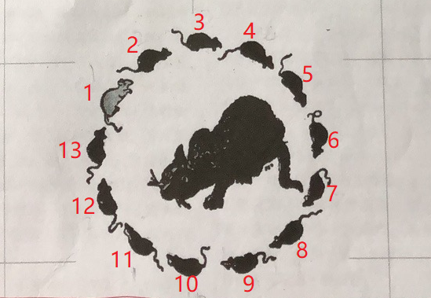

# 猫爪老鼠

如图，有且只有`13`只老鼠，编号为`1`至`13`。编号为`1`的老鼠是白色的，其它`12`只为黑色，围成一个圈。

## 问题一
猫顺时针吃老鼠，从某一个老鼠开始数数，数到`13`时吃掉那只老鼠。然后继续从下一只老鼠开始数，
每数到`13`（命名为**步进数**）就吃掉那只老鼠。例如，从编号为`1`的白色老鼠开始数数，则第一个被吃的老鼠编号是`13`，
第二个被吃的老鼠编号为`1`，第三个被吃掉的老鼠是`3`号，第四个被吃掉的老鼠是`6`号老鼠…… 

问，从编号为几的老鼠开始数，最后一个被吃掉的老鼠是白色的`1`号老鼠？（答案是编号`7`）

## 问题二
问题一是每数到`13`（**步进数**）就吃掉那只老鼠，那么现在从编号为1的白色老鼠开始数，猫的*步进数*是多少，
才能保证最后吃掉的是白色`1`号老鼠？给出最小值即可。（答案是`21`）

## 问题三
从编号为`1`的白色老鼠开始数，猫的**步进数**是多少，才能保证白色老鼠**第三个**被吃掉？给出最小值即可（答案是`100`）
